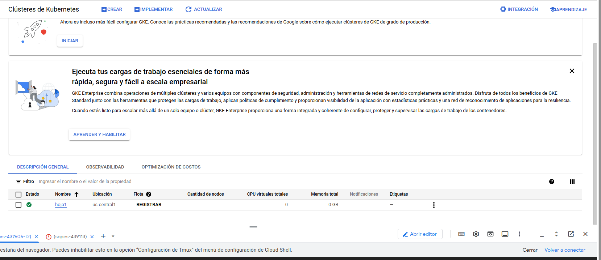

Creación del Kluster

generación de las imagenes

```bash
gcloud container clusters get-credentials hoja1 --region us-central1 --project steady-atlas-437606-t2
```

creación del dockerfile para levantar la imagen de semi

```bash
docker build -t gcr.io/sopes-439113/sopes:v1 .
docker push gcr.io/sopes-439113/sopes:v1
```

el cual el [PROJECT_ID] lo obtenemos de la siguiente manera, le damos click a "Mi First Project" la cual se ve del lado superior izquierdo
```bash
!sopes
```
y nos debe de mostrar el nombre del proyuecto el cual estamos trabajando y su ID
```bash
!sopes-439113
```
# Para la realización de los .yaml
```bash
kubectl apply -f deployment.yaml
kubectl apply -f service.yaml
kubectl apply -f ingress.yaml
```

# Deployment

```yaml
apiVersion: apps/v1
kind: Deployment
metadata:
  name: htq
spec:
  replicas: 1
  selector:
    matchLabels:
      app: htq
  template:
    metadata:
      labels:
        app: htq
    spec:
      containers:
        - name: sopes #nombre del container
          image: gcr.io/sopes-439113/sopes:v1 # This must match the name of the image in the Dockerfile
          ports:
            - containerPort: 8080 # This must match the targetPort in Service.yaml
```

### Aspectos a tener en cuenta

1. **Imagen del contenedor:** Lo primero es asegurarse de que la imagen esté correctamente creada. Si la imagen no existe o no se ha hecho el push al registro, el Pod no podrá ejecutarse. Es esencial verificar que la imagen esté disponible antes de continuar.

2. **MatchLabel:** Este es el identificador que utilizaremos más adelante en el `Service` para referenciar los Pods, por lo que debe coincidir correctamente. Asegúrate de tenerlo presente para la configuración de los demás recursos.

3. **Estado de los Pods:** Al ejecutar el `Deployment`, es importante verificar que los Pods estén en estado "Ready". Si no están listos, podría haber un problema con la obtención de la imagen desde Docker. Puedes comprobar el estado de los Pods utilizando el siguiente comando: 

```bash
kubectl get pods


```bash
kubectl get deployment
```

De manera similar, podemos revisar otros recursos, como el Service o el Ingress, para verificar en qué IP está funcionando nuestro servicio. Al ejecutar get service, esperamos obtener la IP externa, con la cual podremos conectarnos. Después, es necesario configurar el Ingress para redirigir el tráfico correctamente.

# Service

```yaml
apiVersion: v1
kind: Service
metadata:
  name: htq-service
spec:
  type: LoadBalancer
  selector:
    app: htq # This must match the label in Deployment.yaml
  ports:
    - protocol: TCP
      port: 80
      targetPort: 8080 # This must match the containerPort in Deployment.yaml
```

## Tener en cuenta

El valor asignado a la etiqueta app debe coincidir con el matchLabels definido anteriormente. Si no coinciden correctamente, habrá dificultades para identificar el servicio que queremos exponer.


# Ingress

```yaml
apiVersion: networking.k8s.io/v1
kind: Ingress
metadata:
  name: ingress-students
  labels:
    name: ingress-students
  annotations:
    nginx.ingress.kubernetes.io/rewrite-target: /loadStudents
spec:
  ingressClassName: nginx
  rules:
    - host: 35.193.240.41.nip.io
      http:
        paths:
          - path: /agronomy
            pathType: Prefix
            backend:
              service:
                name: htq-service # This must match the name in Service.yaml
                port:
                  number: 80
```

---

## Código de la API en Golang

```Golang
package main

import (
	"encoding/json"
	"fmt"
	"log"
	"net/http"
)

type Student struct {
	Name       string `json:"student"`
	Age        string `json:"age"`
	Faculty    string `json:"faculty"`
	Discipline string `json:"discipline"`
}

// Lista de estudiantes (en memoria)
var students []Student

// Manejar la recepción de estudiantes
func receiveStudentHandler(w http.ResponseWriter, r *http.Request) {
	if r.Method == "POST" {
		var student Student

		// Decodificar el JSON recibido en la estructura
		err := json.NewDecoder(r.Body).Decode(&student)
		if err != nil {
			http.Error(w, err.Error(), http.StatusBadRequest)
			return
		}

		// Agregar el estudiante a la lista
		students = append(students, student)

		// Imprimir la información recibida
		fmt.Printf("Nombre: %s, Edad: %s, Facultad: %s, Disciplina: %s\n", student.Name, student.Age, student.Faculty, student.Discipline)

		// Respuesta de éxito
		w.Header().Set("Content-Type", "application/json")
		w.WriteHeader(http.StatusOK)
		json.NewEncoder(w).Encode(map[string]string{
			"message": "Estudiante recibido correctamente",
		})
	} else {
		http.Error(w, "Método no permitido", http.StatusMethodNotAllowed)
	}
}

// Manejar la carga de estudiantes
func loadStudentsHandler(w http.ResponseWriter, r *http.Request) {
	if r.Method == "GET" {
		// Manejar la solicitud GET
		w.Header().Set("Content-Type", "application/json")
		w.WriteHeader(http.StatusOK)
		json.NewEncoder(w).Encode(students) // Enviar la lista de estudiantes
	} else {
		http.Error(w, "Método no permitido", http.StatusMethodNotAllowed)
	}
}

// Ruta para la raíz
func rootHandler(w http.ResponseWriter, r *http.Request) {
	w.WriteHeader(http.StatusOK)
	fmt.Fprintln(w, "¡Hola Mundo!")
}

func main() {
	http.HandleFunc("/", rootHandler)                         // Ruta raíz
	http.HandleFunc("/receiveStudent", receiveStudentHandler) // Manejar recepción de estudiantes
	http.HandleFunc("/loadStudents", loadStudentsHandler)     // Manejar carga de estudiantes
	fmt.Println("Servidor en ejecución en el puerto 8080...")
	log.Fatal(http.ListenAndServe(":8080", nil))
}

```
---
## Código del Dockerfile
```Dockerfile
# Usar la imagen oficial de Go como base
FROM golang:1.20-alpine

# Establecer el directorio de trabajo dentro del contenedor
WORKDIR /app

# Copiar los archivos del proyecto al contenedor
COPY . .

# Descargar dependencias y compilar la aplicación
RUN go mod tidy && go build -o main .

# Exponer el puerto en el que la aplicación escuchará
EXPOSE 8080

# Comando para ejecutar la aplicación
CMD ["./main"]

```
## Verificación de los Endpoinds
